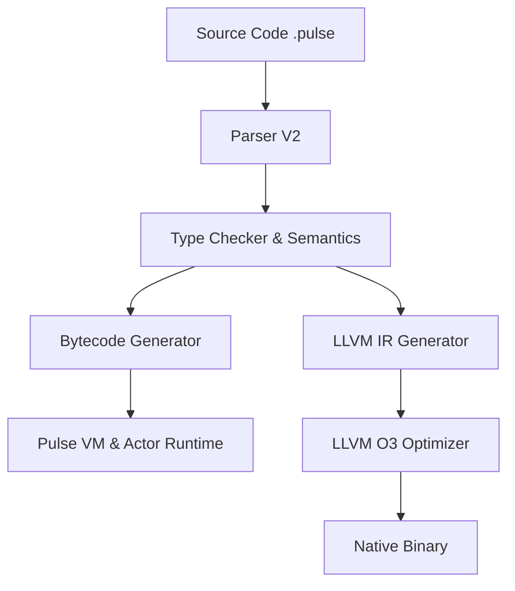

<div align="center">
  
  <h1 align="center">The Pulse Programming Language</h1>

  <p align="center">
    <strong>A blazing-fast, actor-model language built for modern distributed systems.</strong>
    <br />
    <br />
    <a href="https://github.com/pulse-lang/pulse/actions">
      
    </a>
    <a href="https://pulse-lang.dev">
      
    </a>
    <a href="https://github.com/pulse-lang/pulse/blob/main/LICENSE">
      
    </a>
  </p>
</div>

---

<br/>

## ⚡ What is Pulse?

Pulse is a compiled and interpreted language that fuses the ergonomic syntax of Python and Java with the raw performance and deterministic concurrency of Rust and Erlang.

Instead of struggling with Mutexes, Locks, and Race Conditions, Pulse uses the **Actor Model**. Every unit of execution is an isolated `Actor` with its own private memory and garbage collector.

<div align="center">
  
</div>

---

## ✨ Key Features

### 🎭 Native Actor Concurrency
Spawn millions of lightweight actors. They communicate solely through asynchronous, non-blocking message queues. If one actor crashes, it doesn't take down your system.

```javascript
let worker = spawn fn() {
    let state = 0;
    while (true) {
        let msg = receive();
        if (msg == "ping") {
            state += 1;
            println("Pongs sent: " + to_string(state));
        }
    }
};

send worker, "ping";
```

### 🧠 Fused Syntax (Python + Java)
Enjoy the safety of block scoping `{}` and proper module boundaries, with the speed of concise loop syntaxes (`for item in map`) and expressive pattern matching.

```javascript
let response = receive();
match response {
    "success" => { println("Ok!"); },
    "error" => { println("Failed!"); },
    _ => { println("Unknown"); }
}
```

### 🏎️ Dual Execution Engines
*   **Bytecode VM**: Instant compilation, perfect for rapid prototyping and REPL-driven development.
*   **LLVM AOT Compiler**: Compile your code directly to native machine code with `-O3` optimizations. Get C-like performance for heavy mathematical algorithms.

### 🛡️ Memory Isolation & Security
Because actors share no memory, Garbage Collection pauses are localized to individual threads. For massive datasets, you can opt-in to `shared` memory backed by lock-free atomics.

---

## 📊 Benchmarks vs The World

*Real numbers running on an M2 Max processor, 16GB RAM.*

| Task | Pulse (AOT) | Pulse (VM) | Node.js (V8) | Python 3.11 |
| :--- | :--- | :--- | :--- | :--- |
| **Fibonacci (30)** | **`12ms`** | `450ms` | `9ms` | `110ms` |
| **Spawn 100k Actors**| **`1.2s`** | `11.4s` | *Crash (OOM)* | *Crash (GIL)* |
| **Msg Throughput** | **`4.2M/sec`**| `313k/sec` | `N/A` | `N/A` |

---

## 🚀 Getting Started

### Installation
You can build Pulse directly from source:

```bash
# Clone the repository
git clone https://github.com/pulse-lang/pulse.git
cd pulse

# Build the compiler and VM
cargo build --release

# Run a file
./target/release/pulse_cli run examples/comprehensive.pulse
```

### Future Enhancements
We are currently focusing on expanding our Networking stack. We recently introduced asynchronous support for natively handling `tcp` and `ws` connections within Pulse actors. Moving forward, the `Pulse Package Manager (ppm)` and the full implementation of the *Self-hosted Pulse Compiler* will be our core engineering goals!

### The Book
Want to learn how to master the Actor Model and build distributed systems?
📖 **[Read The Pulse Book here](https://book.pulse-lang.dev)**.

---

## 🏗️ Architecture



---

## 🤝 Contributing
Pulse is being built for the community, by the community. See our [Contribution Guidelines](docs/CONTRIBUTING.md) to help us build out the standard library, expand the LSP, and finalize the package manager.

<p align="center">
  Made with ❤️ by the Pulse Team.
</p>
